# Flujo de trabajo en KNIME para la clasificación de la severidad en mamografía

Este repositorio documenta, a nivel básico, un **flujo de trabajo completo en KNIME** para la clasificación de lesiones mamográficas en las clases **benign** y **malignant** a partir de variables clínicas y morfológicas estructuradas. El flujo cubre el ciclo de vida completo de los datos: lectura, preprocesamiento, visualización exploratoria, entrenamiento del modelo, predicción, evaluación y exportación de resultados.

Aunque se trata de un flujo de trabajo intencionadamente sencillo, refleja un ejemplo de aprendizaje supervisado sólido y adecuado para fines demostrativos en análisis de datos biomédicos como ejemplo final de la asignatura Fundamentos de IA.

---

## Visión general del flujo de trabajo

A continuación se muestra el flujo completo implementado en KNIME.

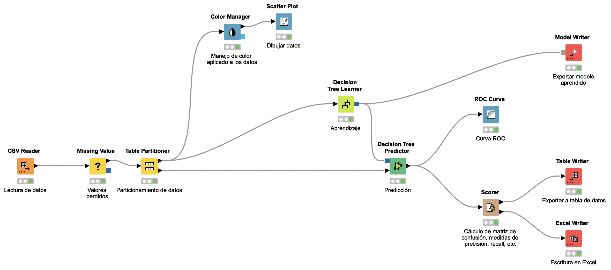

El flujo contiene las siguientes etapas o fases principales:

1. **Lectura y adquisición de datos**
2. **ETL y preparación de datos**
3. **Exploración visual**
4. **Aprendizaje y predicción**
5. **Evaluación del modelo**
6. **Exportación de resultados**

---

## Objetivo del flujo de trabajo

El propósito de este flujo es construir un ejemplo transparente y reproducible capaz de:

- importar un conjunto de datos de mamografía,
- gestionar valores perdidos,
- dividir los datos en subconjuntos de entrenamiento y prueba,
- inspeccionar visualmente la relación entre la edad y la severidad de la lesión,
- entrenar un clasificador de tipo **Decision Tree**,
- predecir la severidad en casos no vistos,
- evaluar el modelo mediante métricas estándar de calidad, y
- exportar los resultados a distintos formatos: modelo, tabla de datos y archivo Excel.

---

## Conjunto de datos y variables utilizadas

A partir de la configuración de los nodos, el flujo utiliza las siguientes variables:

- **BIRADS**
- **AGE**
- **SHAPE**
- **MARGIN**
- **DENSITY**
- **SEVERITY** (clase objetivo)

La variable objetivo es categórica y contiene las etiquetas:

- `benign`
- `malignant`

---

# 1. Fase 1: Lectura y adquisición de datos

Esta fase actúa como punto de entrada del flujo de trabajo. Su objetivo es transformar datos externos en un formato estructurado que KNIME pueda procesar de forma segura y reproducible.

## CSV Reader

El nodo **CSV Reader** importa el conjunto de datos de mamografía desde una fuente externa. En este caso, el archivo se lee desde una URL raw de GitHub. Se presta especial atención a que el delimitador y la estructura del fichero se interpreten correctamente.

**Detalles de configuración observados en el nodo:**

- Fuente: URL externa raw de un CSV
- Delimitador de filas: salto de línea
- Delimitador de columnas: coma `,`
- Carácter de comentario: `#`
- Líneas iniciales omitidas: `0`
- Se emplean los caracteres estándar de comillas y escape

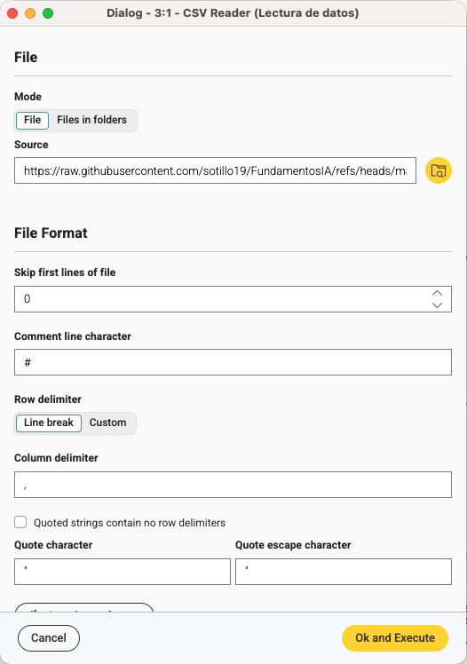

### Por qué esta fase es importante

Un flujo de aprendizaje automático supervisado solo es fiable si los datos de origen se importan correctamente. Un delimitador mal interpretado, una cabecera leída de forma incorrecta o un problema de codificación puede invalidar todos los análisis posteriores.

---

# 2. Fase 2: Manipulación de datos (ETL)

Esta fase prepara los datos brutos para su análisis y modelado. Es una de las etapas más relevantes, ya que la calidad del modelo final depende directamente de la calidad de los datos de entrada.

## Missing Value

El nodo **Missing Value** se utiliza para gestionar observaciones incompletas.

**Detalles de configuración observados en el nodo:**

- Columnas tratadas explícitamente:
  - `BIRADS`
  - `AGE`
  - `SHAPE`
  - `MARGIN`
  - `DENSITY`
- Método de tratamiento: **Linear Interpolation**
- Existen opciones de tratamiento por tipo de dato para campos Integer y String

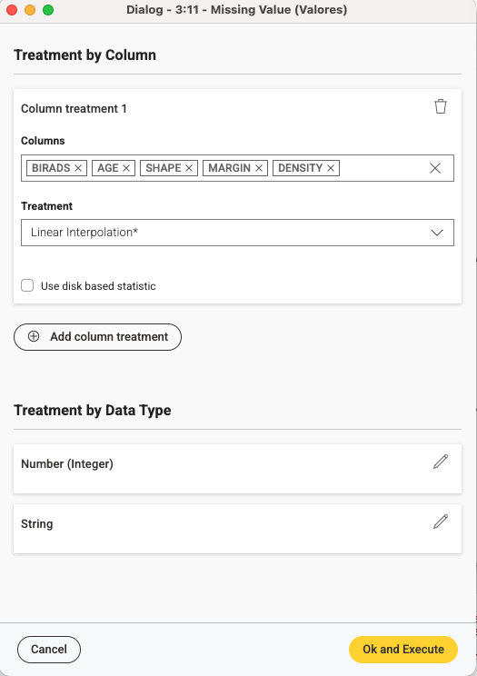

### Interpretación

En términos prácticos, este nodo evita que las entradas incompletas interrumpan el entrenamiento del modelo o sesguen el proceso de aprendizaje. En un conjunto de datos clínico, los valores ausentes pueden corresponder a anotaciones morfológicas faltantes o a la edad de la paciente.

Además, el nodo **Missing Value** permite aplicar distintos tratamientos según la columna o el tipo de dato. Entre las opciones habituales del nodo se incluyen, entre otras, la sustitución por un valor fijo, la media, la mediana, la moda, el valor mínimo o máximo, el valor anterior o siguiente, la interpolación lineal, así como la eliminación de filas o el uso de estrategias específicas según si la variable es numérica o categórica. Esto convierte al nodo en una herramienta flexible para adaptar la limpieza de datos a las necesidades concretas del análisis.

## Table Partitioner

El nodo **Table Partitioner** divide el conjunto de datos limpio en subconjuntos de entrenamiento y prueba.

**Detalles de configuración observados en el nodo:**

- Tipo de partición: **Relative (%)**
- Tamaño de la partición de entrenamiento: **80%**
- Estrategia de muestreo: **Stratified**
- Columna de agrupación: `SEVERITY`
- Semilla aleatoria fija activada: `1678807467440`

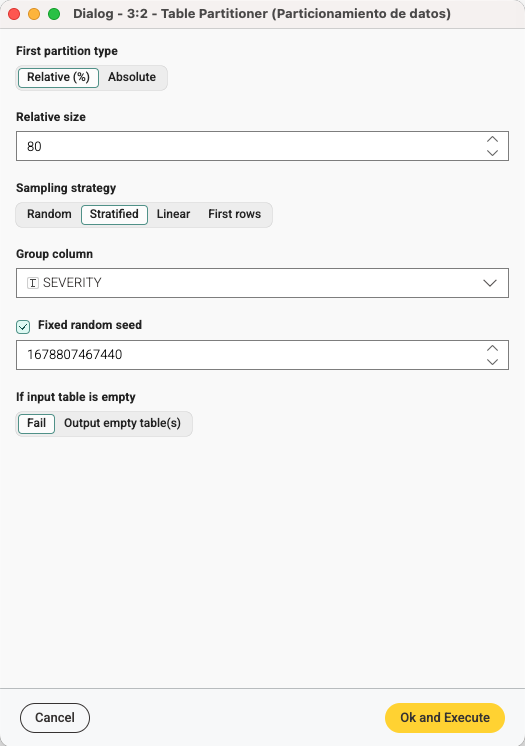

### Por qué esta fase es importante

La división entrenamiento/prueba es esencial para evaluar el modelo de forma justa. Al utilizar **muestreo estratificado**, el flujo preserva la distribución de la clase `SEVERITY` en ambos subconjuntos, algo especialmente importante en problemas médicos donde puede existir desbalanceo de clases.

---

# 3. Fase 3: Exploración visual de los datos

La exploración visual ayuda a validar supuestos antes de entrenar el modelo. Aporta una etapa de inspección humana que puede revelar valores atípicos, desbalanceo entre clases o tendencias evidentes.

## Color Manager

El nodo **Color Manager** asigna colores semánticos a las clases objetivo.

**Detalles de configuración observados en el nodo:**

- Columna usada para colorear: `SEVERITY`
- Mapeo nominal de colores:
  - `benign` → verde
  - `malignant` → rojo

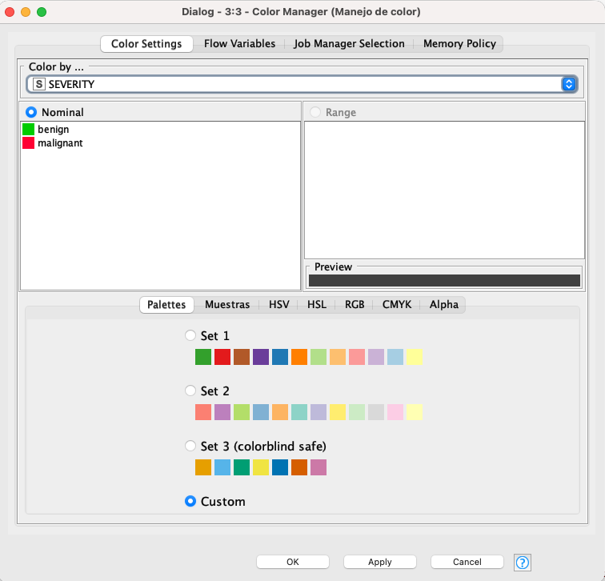

Esta codificación cromática mejora la interpretabilidad de las gráficas posteriores y hace visualmente inmediata la separación entre clases.

## Scatter Plot

El flujo práctico mostrado en las capturas utiliza un nodo **Scatter Plot** para la exploración.

**Detalles de configuración observados en el nodo:**

- Dimensión horizontal: `AGE`
- Dimensión vertical: `SEVERITY`
- Dimensión de color: `SEVERITY`
- Máximo de filas mostradas: `2500`
- Escala del eje horizontal: **Linear**
- Límites de eje automáticos activados

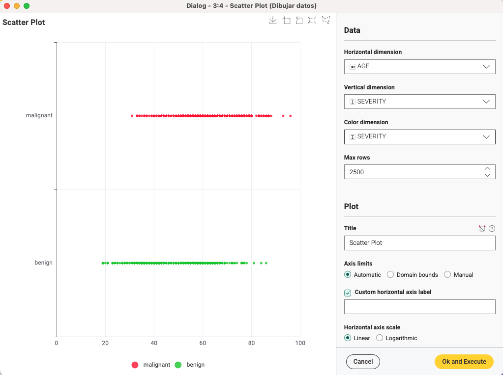

### Interpretación

Esta gráfica permite una inspección visual rápida de cómo se distribuye la edad entre las dos clases de salida. Dado que `SEVERITY` es categórica, el gráfico sitúa `benign` y `malignant` en dos bandas horizontales diferentes y usa el color para reforzar esa distinción.


---

# 4. Fase 4: Aprendizaje y predicción

Esta fase constituye el núcleo analítico del flujo de trabajo. Convierte los datos ya preparados en un modelo predictivo y aplica dicho modelo a casos no vistos previamente.

## Decision Tree Learner

El nodo **Decision Tree Learner** se entrena con el 80% de los datos asignados a entrenamiento.

**Detalles de configuración:**

- **Columna de clase: `SEVERITY`**  
  Define la variable objetivo que el algoritmo debe aprender a predecir. En este flujo, el árbol se entrena para clasificar cada registro en una de las dos clases disponibles: `benign` o `malignant`.

- **Medida de calidad: `Gini index`**  
  Indica el criterio utilizado para decidir cuál es la mejor partición en cada nodo del árbol. El índice Gini mide la impureza de los grupos generados: cuanto menor es su valor, más homogéneo es el subconjunto resultante. El algoritmo selecciona, por tanto, las divisiones que mejor separan las clases.

- **Método de poda: `No pruning`**  
  Señala que no se aplica poda posterior al árbol una vez construido. Esto permite conservar toda la estructura generada durante el entrenamiento, aunque también puede producir árboles más complejos y con mayor riesgo de sobreajuste si el conjunto de datos contiene ruido.

- **Número mínimo de registros por nodo: `2`**  
  Establece el mínimo de ejemplos que debe contener un nodo para que pueda seguir dividiéndose. Con un valor bajo como este, el algoritmo puede generar ramas más específicas y detalladas, lo que incrementa la capacidad de ajuste del modelo a los datos de entrenamiento.

- **Número de registros a almacenar para visualización: `10000`**  
  Determina cuántos registros se conservan internamente para facilitar la representación visual del árbol y su inspección posterior dentro de KNIME. No modifica el aprendizaje del modelo, sino la capacidad de explorarlo gráficamente.

- **Average split point: activado**  
  Esta opción afecta al tratamiento de variables numéricas. Cuando se activa, KNIME utiliza puntos de corte promediados entre valores candidatos al generar divisiones, lo que puede producir particiones más estables y fáciles de interpretar.

- **Número de hilos: `10`**  
  Indica el número de hilos de ejecución que KNIME puede emplear para acelerar el proceso de entrenamiento. Se trata de un parámetro relacionado con el rendimiento computacional, no con la lógica predictiva del modelo.

- **Skip nominal columns without domain information: activado**  
  Esta opción hace que el algoritmo ignore columnas nominales que no tengan definida correctamente su información de dominio. De este modo se evita que variables categóricas mal especificadas generen errores o comportamientos ambiguos durante el entrenamiento.

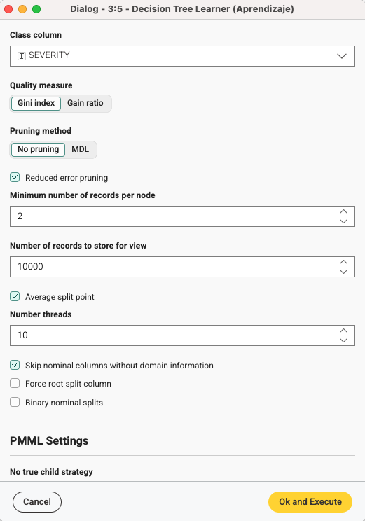

### Interpretación

El árbol de decisión aprende reglas a partir de variables predictoras como `AGE`, `BIRADS`, `SHAPE`, `MARGIN` y `DENSITY` para clasificar la severidad de la lesión. Una de las principales fortalezas de este modelo es su interpretabilidad, ya que el resultado puede leerse como un conjunto de reglas comprensibles por humanos.

En la visualización del árbol se observa que la **variable más influyente en la raíz es `BIRADS`**, ya que constituye la primera partición del modelo. Esto indica que, dentro del conjunto de entrenamiento utilizado, el nivel BI-RADS es el atributo que mejor separa inicialmente los casos benignos y malignos. El primer corte se sitúa en **4.5**, de forma que los casos con **`BIRADS <= 4.5`** quedan asociados mayoritariamente a la clase **benign**, mientras que los casos con **`BIRADS > 4.5`** se asocian predominantemente a **malignant**.

En la **rama izquierda** del árbol, correspondiente a **`BIRADS <= 4.5`**, la siguiente variable relevante es **`SHAPE`**. Cuando **`SHAPE <= 3.5`**, el modelo mantiene una clasificación mayoritariamente benigna y todavía incorpora un nuevo corte sobre **`AGE`** en **67.5** años. En esta subrama, los casos con **`AGE <= 67.5`** se clasifican de forma muy claramente benigna, mientras que los casos con **`AGE > 67.5`** siguen siendo mayoritariamente benignos, aunque con una proporción de malignidad más alta. En cambio, cuando **`SHAPE > 3.5`** dentro de esta misma rama izquierda, el árbol dirige la decisión hacia un nodo donde interviene **`MARGIN`**. Ahí se observa que los márgenes más bajos (**`MARGIN <= 3.5`**) siguen vinculándose a casos benignos, mientras que márgenes más altos (**`MARGIN > 3.5`**) desplazan la predicción hacia **malignant**.

En la **rama derecha** del árbol, correspondiente a **`BIRADS > 4.5`**, el modelo ya parte de una predominancia clara de casos malignos. De nuevo aparece **`SHAPE`** como variable de decisión. Cuando **`SHAPE > 3.5`**, la clasificación es muy claramente **malignant**, con una pureza muy elevada en ese nodo. Cuando **`SHAPE <= 3.5`**, el árbol introduce un nuevo corte sobre **`AGE`** en **76.5** años. En ambas subramas resultantes la predicción continúa siendo **malignant**, aunque el grupo de mayor edad queda completamente asociado a esa clase en la muestra mostrada.

De forma global, el árbol sugiere una interpretación clínica intuitiva: **`BIRADS`** actúa como criterio principal de separación, mientras que **`SHAPE`**, **`MARGIN`** y **`AGE`** refinan la decisión en situaciones intermedias. En otras palabras, el modelo reproduce una lógica jerárquica donde primero utiliza la evaluación radiológica global y después incorpora rasgos morfológicos y edad para resolver casos menos evidentes. Esto hace que el árbol no solo funcione como clasificador, sino también como una representación explícita de reglas de decisión fáciles de comunicar e interpretar.


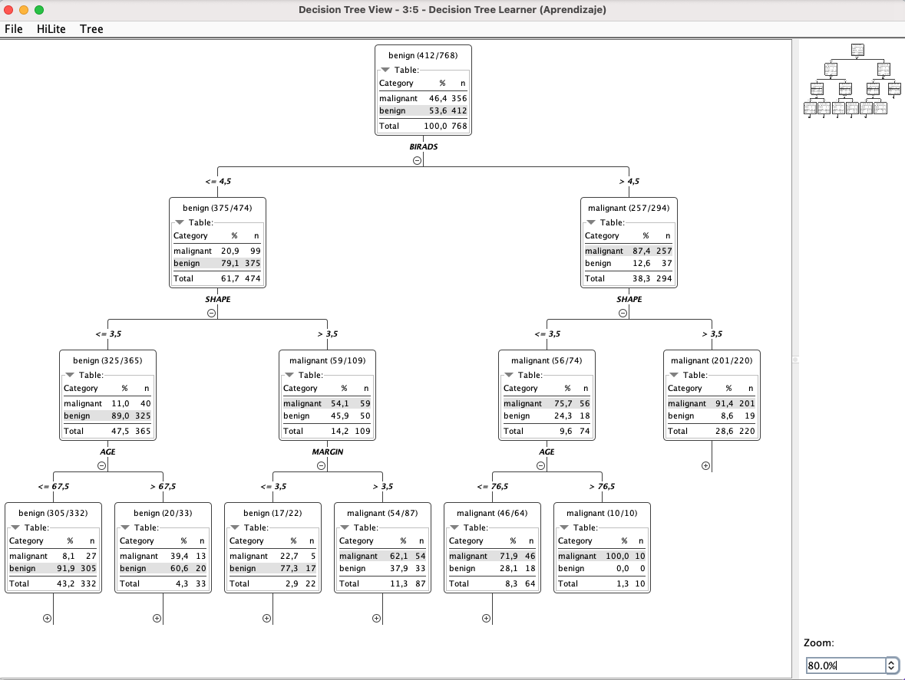

### Qué se interpreta en el árbol

La lectura del árbol debe hacerse **de arriba hacia abajo**. Cada nodo interno representa una condición sobre una variable, y cada rama indica el resultado de cumplir o no dicha condición. Los nodos terminales o hojas muestran la **clase predicha** y la distribución de ejemplos que llegan a ese punto.

En esta visualización, cada caja incluye tres elementos fundamentales:

- la **clase mayoritaria predicha** en el nodo,
- la **proporción y número de casos** de cada clase que contiene,
- y el **total de registros** que alcanzan ese punto del árbol.

Por ejemplo, el nodo raíz muestra que el conjunto de entrenamiento contiene una ligera mayoría de casos **benign**. A partir de ahí, el árbol aplica sucesivamente reglas sobre `BIRADS`, `SHAPE`, `MARGIN` y `AGE` para aumentar la pureza de las particiones. Cuanto más homogéneo es un nodo, más fiable resulta la predicción asociada a esa hoja.

Desde el punto de vista interpretativo, este tipo de visualización permite identificar:

- qué variables tienen **mayor peso** en la clasificación,
- en qué **umbrales** se producen las decisiones,
- qué combinaciones de atributos conducen a una predicción **benigna** o **maligna**,
- y qué ramas contienen nodos más puros o, por el contrario, más ambiguos.

En este caso, el árbol revela que la decisión no depende de una única variable aislada, sino de una **secuencia jerárquica de criterios**. Esa estructura es precisamente una de las principales ventajas del modelo, ya que facilita explicar el comportamiento del clasificador de forma comprensible para contextos docentes y para escenarios donde la interpretabilidad del modelo es importante.

## Decision Tree Predictor

El nodo **Decision Tree Predictor** se encarga de aplicar un modelo previamente entrenado sobre nuevos datos de entrada. Su función general dentro del flujo es recibir, por un lado, el modelo generado en la fase de aprendizaje y, por otro, una tabla con registros no utilizados durante el entrenamiento, para producir como salida una nueva tabla enriquecida con las predicciones del clasificador.

En este caso concreto, el nodo aplica el árbol de decisión entrenado al 20% de los datos reservados para prueba, generando para cada registro una predicción de la variable objetivo \`SEVERITY\`, que posteriormente podrá analizarse en términos de clases \`benign\` y \`malignant\`.

**Detalles de configuración:**

- **Número máximo de patrones para hiliting: `10000`**  
  Define cuántos registros pueden quedar asociados al mecanismo de *hiliting* de KNIME, es decir, al resaltado interactivo entre vistas y nodos. Este parámetro no modifica la predicción del modelo, pero facilita la exploración visual y el seguimiento de casos concretos dentro del flujo.

- **Nombre de la columna de predicción: `Prediction (Severity)`**  
  Especifica el nombre de la nueva columna que el nodo añadirá a la tabla de salida con la clase predicha por el modelo. En este caso, esa columna contendrá para cada registro de prueba la etiqueta estimada por el árbol de decisión, es decir, `benign` o `malignant`.

- **Añade la distribución normalizada de clases: activado**  
  Indica que, además de la clase final predicha, el nodo incorporará información adicional sobre cómo se reparte la probabilidad o confianza del modelo entre las distintas clases posibles. Esto permite no solo conocer la decisión final del clasificador, sino también analizar con qué grado relativo de apoyo se ha emitido esa predicción.

- **Nombre de la columna de distribución: `Prediction (Severity) normalized`**  
  Define el nombre de la columna o conjunto de columnas donde se almacenará esa distribución normalizada de clases generada por el predictor. Esta salida es especialmente útil para nodos posteriores de evaluación, como la curva ROC, ya que proporciona la puntuación continua necesaria para analizar el comportamiento del clasificador más allá de la etiqueta final.

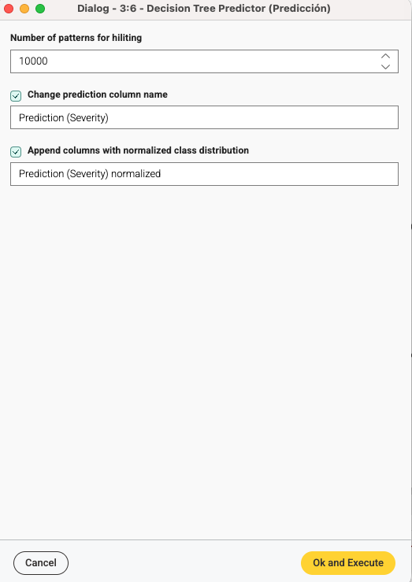


---

# 5. Fase 5: Evaluación y control de calidad

Esta fase cuantifica el rendimiento del modelo y permite valorar si el clasificador es adecuado para su interpretación y discusión.

## ROC Curve

El flujo incluye un nodo **ROC Curve** conectado tras la etapa de predicción. Su función es analizar el equilibrio entre la tasa de verdaderos positivos y la tasa de falsos positivos, y resumir la capacidad discriminativa del modelo. En un problema de clasificación binaria, la curva ROC es una herramienta clave porque permite, por ejemplo, evaluar cómo de bien el clasificador separa lesiones malignas de benignas para distintos umbrales.

La siguiente captura muestra el análisis ROC configurado con `SEVERITY` como columna objetivo, `malignant` como clase positiva y la columna de probabilidad normalizada generada por el predictor como entrada de puntuación. El valor obtenido es **AUC = 0.814**, lo que indica una capacidad discriminativa buena para este ejemplo.

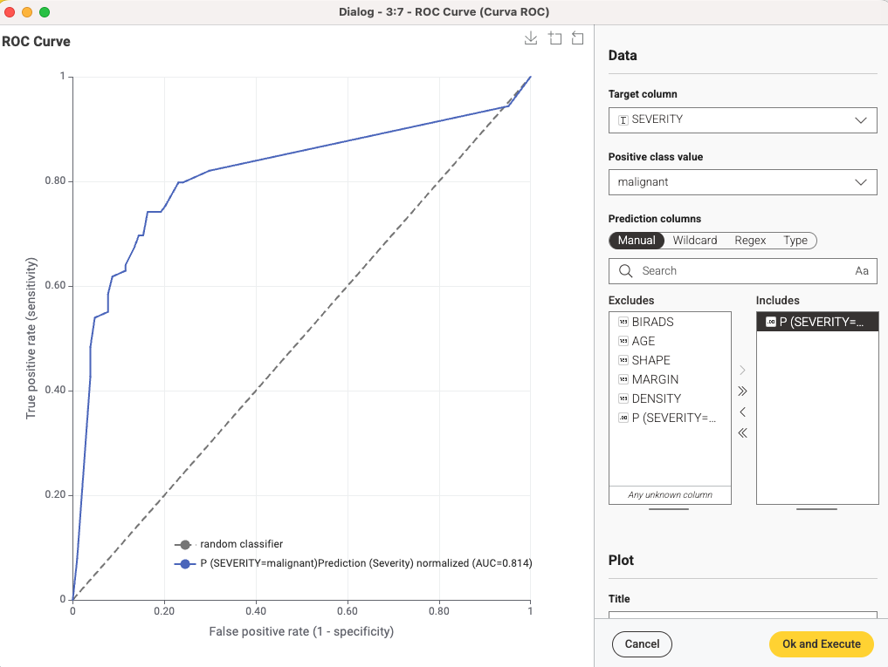

## Scorer

El nodo **Scorer** compara la clase predicha con la verdad de referencia. Proporciona métricas como la matriz de confusión, exactitud global, precisión, recall/sensibilidad, etc.

**Detalles de configuración:**

- Primera columna: `Prediction (Severity)`
- Segunda columna: `SEVERITY`
- Estrategia de ordenación: **Insertion order**
- Tratamiento de valores ausentes: **Ignore**

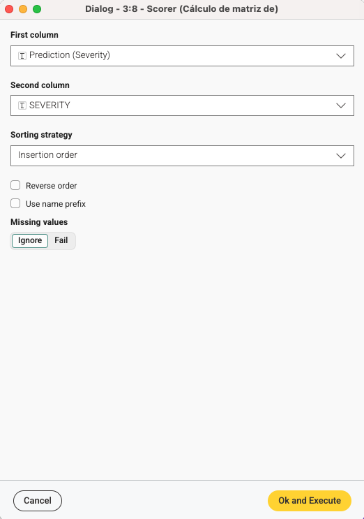

### Matriz de confusión

La matriz de confusión es una de las salidas más importantes del nodo **Scorer**, ya que permite comparar de forma estructurada las clases predichas por el modelo con las clases reales del conjunto de prueba. Su función general, como vimos en el Tema 1, es mostrar en una única tabla, cuántos casos han sido clasificados correctamente y cuántos han sido asignados a una categoría incorrecta.

En términos generales, esta matriz constituye una herramienta clave para interpretar el comportamiento de cualquier clasificador, ya que no solo resume el número total de aciertos y errores, sino también el tipo concreto de error que se está produciendo. Esto resulta especialmente relevante en problemas de clasificación binaria, donde no todos los fallos tienen la misma importancia práctica o clínica.

En este flujo, la matriz de confusión obtenida con el nodo **Scorer** se muestra a continuación.

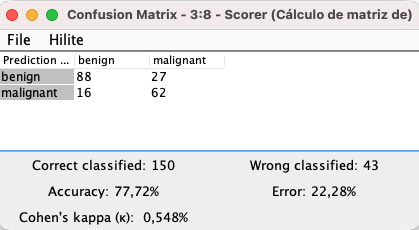

- **Verdaderos negativos (benign predicho como benign):** 88
- **Falsos negativos (benign predicho cuando en realidad el caso es malignant):** 27
- **Falsos positivos (malignant predicho cuando en realidad el caso es benign):** 16
- **Verdaderos positivos (malignant predicho como malignant):** 62

Esto significa que el modelo clasificó correctamente **150** casos y clasificó incorrectamente **43**, con una exactitud global de **77.72%** y un valor de **Cohen’s kappa = 0.548**. El índice **Cohen’s kappa** es una medida de concordancia entre dos clasificaciones que corrige el acuerdo esperado por azar. En este contexto, permite cuantificar hasta qué punto las predicciones del modelo coinciden con la clase real más allá de lo que podría ocurrir de forma aleatoria, por lo que aporta una visión más robusta que la exactitud global cuando se evalúa el rendimiento del clasificador.

### Estadísticas de exactitud

Las estadísticas por clase reportadas por KNIME también están disponibles en la tabla de salida.

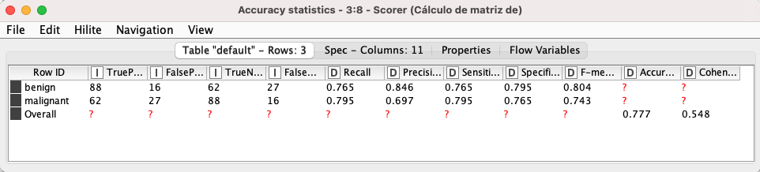

A partir de esta tabla, los valores más relevantes son:

- Para la clase **benign**:
  - Recall: **0.765**
  - Precision: **0.846**
  - Sensitivity: **0.765**
  - Specificity: **0.795**
  - F-measure: **0.804**

- Para la clase **malignant**:
  - Recall: **0.795**
  - Precision: **0.697**
  - Sensitivity: **0.795**
  - Specificity: **0.765**
  - F-measure: **0.743**

- Global:
  - Accuracy: **0.777**
  - Cohen’s kappa: **0.548**

---

# 6. Fase 6: Exportación e informes

La fase final representa la interoperabilidad de los resultados y cierra el ciclo de vida de los datos, transformando la inteligencia extraída en un activo digital reutilizable fuera del entorno KNIME. Su importancia es tanto estratégica como práctica, ya que permite desplegar el modelo en entornos reales, comunicar los hallazgos mediante informes estandarizados e integrar los datos procesados con otros sistemas de información.

## Nodos de salida y persistencia de resultados

En esta fase final, empleamos nodos de salida especializados para dar salida a **tres tipos de conocimiento complementarios**, permitiendo no solo conservar los resultados del experimento, sino también reutilizarlos, auditarlos y comunicarlos fuera del entorno de desarrollo.

### Model Writer

El nodo **Model Writer** se encarga de persistir el "cerebro" del sistema: el árbol de decisión ya entrenado, es decir, el objeto modelo generado en la fase de aprendizaje. Al guardar este modelo en un archivo específico, permitimos que pueda ser cargado posteriormente por cualquier otro profesional o sistema sin necesidad de repetir todo el proceso de entrenamiento. De este modo, si llega una nueva paciente a la consulta, bastaría con cargar este activo digital para obtener una predicción instantánea.

### Table Writer

En este flujo, se incorpora un nodo **Table Writer** conectado específicamente a la salida del nodo **Scorer**. Su función es exportar los resultados tabulares derivados de la evaluación del modelo, como la matriz de confusión o las estadísticas de precisión, sensibilidad y especificidad. Al persistir estos resultados en un formato nativo de KNIME, se garantiza que el registro del rendimiento del clasificador quede almacenado para auditorías técnicas, análisis comparativos posteriores o reutilización interna dentro de otros flujos.

### Excel Writer

El nodo **Excel Writer** se utiliza para formalizar los resultados de la evaluación y la lista de predicciones en un formato universalmente aceptado como es la hoja de cálculo. Esta salida mejora la reproducibilidad del flujo, facilita la comunicación con usuarios no técnicos, favorece la integración de los resultados en informes o materiales docentes y refuerza la auditabilidad del proceso analítico. En un contexto aplicado, esto permite, por ejemplo, que un profesional exporte el informe de rendimiento del modelo —incluyendo métricas como sensibilidad, especificidad o precisión— para incorporarlo a una memoria de investigación, una sesión clínica o un informe técnico.

---

# Lógica end-to-end del flujo de trabajo

De forma resumida, el flujo se comporta así:

1. Leer el conjunto de datos de mamografía desde un CSV.
2. Limpiar valores incompletos.
3. Dividir los datos en entrenamiento y prueba mediante una partición estratificada 80/20.
4. Generar una visualización exploratoria de edad frente a severidad usando colores semánticos.
5. Entrenar un clasificador de árbol de decisión con el subconjunto de entrenamiento.
6. Predecir la clase del subconjunto de prueba no visto.
7. Evaluar las predicciones mediante curva ROC y nodo Scorer.
8. Exportar los resultados a distintos formatos: modelo, tabla y Excel.

---

# Estructura del repositorio

```text
.
├── README.md
├── data/
│   └── mammographic_data.csv
├── workflow/
│   └── KNIME_FundamentosIA.knwf
├── output/
│   └── Export_mamograficExample.model
│   └── Export_mamograficExample.table
│   └── Export_mamograficExample.xlsx
└── images/
    ├── workflow-overview.png
    ├── csv-reader.png
    ├── missing-value.png
    ├── table-partitioner.png
    ├── color-manager.png
    ├── scatter-plot.png
    ├── decision-tree-learner.png
    ├── decision-tree-predictor.png
    ├── scorer.png
    ├── roc-curve.png
    ├── confusion-matrix.png
    └── accuracy-statistics.png
    
```
